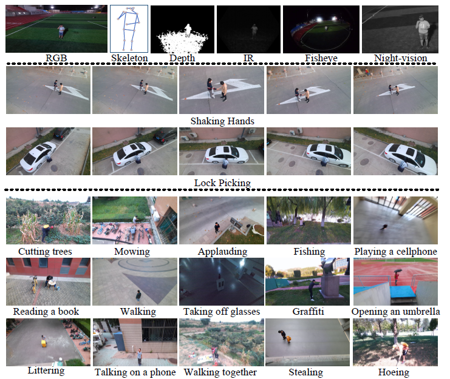

# UAV-Human

**Official repository for CVPR2021: UAV-Human: A Large Benchmark for Human Behavior Understanding with Unmanned Aerial Vehicle**



## Paper

[[CVF OpenAccess](https://openaccess.thecvf.com/content/CVPR2021/papers/Li_UAV-Human_A_Large_Benchmark_for_Human_Behavior_Understanding_With_Unmanned_CVPR_2021_paper.pdf)] [[arXiv](https://arxiv.org/abs/2104.00946)] [[ResearchGate](https://www.researchgate.net/publication/350558689_UAV-Human_A_Large_Benchmark_for_Human_Behavior_Understanding_with_Unmanned_Aerial_Vehicles)]

## Dataset Download

The dataset is available for [Download](https://sutdcv.github.io/uav-human-web/) now!

<!-- **FAQs:**

**Q1:** Is my competition result in MMVRAC comparable with the results reported in your original paper?

**A1:** No. During our ICCVW2021 MMVRAC competition, only part of the testing data is released, and therefore the result obtained in the MMVRAC competition is **NOT** comparable with the results reported in our paper. If you try to publish an academic paper on our benchmark, please follow the above [link](https://sutdapac-my.sharepoint.com/:f:/g/personal/tianjiao_li_mymail_sutd_edu_sg/EtLLkN49_C9Bq14ur0ZLpHkB-bi9Tc_LlIQBv0Ds4JE49A?e=IqX67X) and download the whole released dataset.

**Q2:** Which identity should I use to train my ReID model, the person ID or the setup ID?

**A2:** In our original paper, we combined the person IDs and subject IDs as the identities to train our model. However, we provide person ID and setup ID to give more choices for you to train and evaluate your own models.

**Q3:** In your ReID dataset, is it the case that you combined the subject ids with the setup ids to obtain 1,144 identities?

**A3:** Yes. In order to publish our ReID dataset to the public, we have to obtain the consent forms from all the captured subjects, and then we are allowed to distribute the videos containing the captured subjects to the community. -->

## Annotations

VideoNames: **P**070**S**01**G**10**B**00**H**10**UC**102000**LC**092000**A**031**R**0\_**09131758**.avi

**P**070: (**P**ersonID) unique person ID for the main subject in current video

**S**01: (**S**etupID) setup id that indicates changes of clothing, hat, backpack of the main subject

**G**10: (**G**ender) first bit represents main subject's gender, second bit represents auxiliary subject's gender

`0: n/a; 1: male; 2: female`

**B**00: (**B**ackpack) first bit represents main subject's backpack color, second bit represents auxiliary subject's backpack color

`0: n/a; 1: red; 2: black; 3: green; 4: yellow`

**H**10: (**H**at) first bit represents main subject's hat color, second bit represents auxiliary subject's hat color

`0: n/a; 1: red; 2: black; 3: green; 4: white`

**UC**102000: (**U**pper**C**lothing) first three bits represent main subject's upper clothing color (2 bits) and style (1 bit), last three bits represent auxiliary subject's upper clothing color (2 bits) and style (1 bit)

`color: 0: n/a; 1: red; 2: black; 3: blue; 4: green; 5: multicolor; 6: grey; 7: white; 8: yellow; 9: dark brown; 10: purple; 11: pink`

`style: 0: n/a; 1: long; 2: short; 3: skirt`

**LC**102000: (**L**ower**C**lothing) first three bits are main subject's lower clothing color (2 bits) and style (1 bit), last three bits are auxiliary subject's lower clothing color (2 bits) and style (1 bit)

`color: 0: n/a; 1: red; 2: black; 3: blue; 4: green; 5: multicolor; 6: grey; 7: white; 8: yellow; 9: dark brown; 10: purple; 11: pink`

`style: 0: n/a; 1: long; 2: short; 3: skirt`

**A**031: (**A**ction) action labels of current sample

**R**00: (**R**eplicate) replicate capturing

09131758: capturing timestamp, month(2 bits)/day(2 bits)/hour(2 bits)/minute(2 bits)

<!-- SkeletonFileNames: -->
<!-- **P**070**S**01**G**10**B**00**H**10**UC**102000**LC**092000**A**031**R**0_09131758.txt -->

<!-- ImageFileNames: -->
<!-- **P**070**S**01**G**10**B**00**H**10**UC**102000**LC**092000**A**031**R**0_09131758_117_bbox.jpg -->

<!-- |Seg|Descriptions|Detailed Description
|:-:|:-:|:-:|
|**P**070| Main Subject Person ID | Unique person ID for each subject |
|**S**01| Main Subject Setup ID | Setup ID when main subject changes clothing/backpack/hat |
|**G**10| Genders: 2bits  | 0 - N/A <br> 1 - Male <br>  2 - Female |
|**B**00| Backpack Color | 0 - No Backpack <br> 1 - Red, 2 - Black <br> 3 - Green, 4 - Yellow|
|**H**10| Hat Color | 0 - No Backpack <br> 1 - Red, 2 - Black <br> 3 - Yellow, 4 - White|
|**UC**102000| Upper Clothing <br> Style & Color | *Style*: 0 - N/A, 1 - Long, 2 - Short, 3 - Skirt <br> *Color*: 0 - N/a, 1 - Red, 2 - Black, 3 - Blue, 4 - Green, 5 - Multicolor, 6 - Grey, 7 - White, 8 - Yellow, 9 - Dark Brown, 10 - Purple, 11 - Pink |
|**LC**092000| Lower Clothing <br> Style & Color | *Style*: 0 - N/A, 1 - Long, 2 - Short, 3 - Skirt <br> *Color*: 0 - N/a, 1 - Red, 2 - Black, 3 - Blue, 4 - Green, 5 - Multicolor, 6 - Grey, 7 - White, 8 - Yellow, 9 - Dark Brown, 10 - Purple, 11 - Pink |
|**A**031| Action Category | Action label starting from 0 |
|**R**0| Replicate | Replicate capturing |
|09/13/17/58| Timestamp | Month/Day/Hour/Minute

**Note: For Two-Persons Attr, number(s) before slash '/' represent the first person attribute and number(s) after slash '/' represent the second person attribute** -->

## Action Recognition Evaluation Protocols

### Cross-Subject-v1

In cross-subject-v1 evaluation, we split 119 subjects into training and testing groups. The IDs of training subjects are 0, 2, 5, 6, 7, 8, 10, 11, 12, 13, 14, 15, 16, 17, 18, 19, 20, 21, 25, 26, 27, 28, 29, 30, 32, 33, 34, 35, 36, 37, 38, 39, 40, 42, 43, 44, 45, 46, 47, 48, 49, 50, 51, 52, 53, 55, 56, 57, 59, 61, 62, 63, 64, 65, 67, 68, 69, 70, 71, 73, 76, 77, 78, 79, 80, 81, 82, 83, 84, 85, 86, 87, 88, 89, 90, 98, 100, 102, 103, 105, 106, 110, 111, 112, 114, 115, 116, 117, 118; the remaining subjects are for testing.

### Cross-Subject-v2

In cross-subject-v2 evaluation, we split 119 subjects into training and testing groups. The IDs of training subjects are 0, 3, 4, 5, 6, 8, 10, 11, 12, 14, 16, 18, 19, 20, 21, 22, 24, 26, 29, 30, 31, 32, 35, 36, 37, 38, 39, 40, 43, 44, 45, 46, 47, 49, 52, 54, 56, 57, 59, 60, 61, 62, 63, 64, 66, 67, 69, 70, 71, 72, 73, 74, 75, 77, 78, 79, 80, 81, 83, 84, 86, 87, 88, 89, 91, 92, 93, 94, 95, 96, 97, 99, 100, 101, 102, 103, 104, 106, 107, 108, 109, 110, 111, 112, 113, 114, 115, 117, 118; the remaining subjects are for testing.

### Results

#### Evaluation on I3D

| Modality      | CSv1 - Acc (%) | CSv2 - Acc (%) |
| ------------- | -------------- | -------------- |
| RGB Video     | 23.86          | 29.53          |
| Fisheye Video | 20.76          | 34.12          |

#### Evaluation on skeleton

| Methods   | CSv1 - Acc (%) | CSv2 - Acc (%) |
| --------- | -------------- | -------------- |
| DGNN      | 29.90          | -              |
| ST-GCN    | 30.25          | 56.14          |
| 2s-AGCN   | 34.84          | 66.68          |
| HARD-Net  | 36.97          | -              |
| Shift-GCN | 37.98          | 67.04          |
| MS-G3D    | -              | 69.87          |

## Video Processing Guidance

Please refer to [utils/convert_videos_to_frames.py](utils/convert_videos_to_frames.py) and following:

`python convert_videos_to_frames.py --videos path/to/all/videos --frames path/to/output/frames`

## Citation

```bibtex
@InProceedings{Li_2021_CVPR,
    author    = {Li, Tianjiao and Liu, Jun and Zhang, Wei and Ni, Yun and Wang, Wenqian and Li, Zhiheng},
    title     = {UAV-Human: A Large Benchmark for Human Behavior Understanding With Unmanned Aerial Vehicles},
    booktitle = {Proceedings of the IEEE/CVF Conference on Computer Vision and Pattern Recognition (CVPR)},
    month     = {June},
    year      = {2021},
    pages     = {16266-16275}
}
```

## Contact

`tianjiao_li [at] mymail.sutd.edu.sg`
